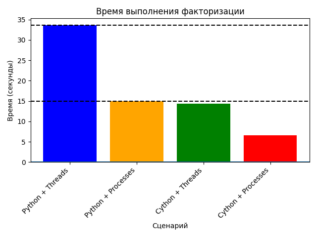

# Проект Fermat Factorization - Cython оптимизация

## Описание

Проект реализует алгоритм факторизации Ферма на Python с оптимизацией производительности через Cython. Содержит две реализации: чистый Python и ускоренную Cython версию.

## Структура проекта

```
project/
├── fermat_cython.pyx     # Cython исходный код
├── setup.py              # Скрипт для компиляции
├── ferma_fact.py        # Чистая Python реализация
└── benchmark.py   # Скрипт для тестирования производительности
```

## Требования

### Основные зависимости
```bash
pip install cython
```

### Дополнительные требования
- Компилятор C/C++ (для сборки Cython расширений)
- Python 3.6+

## Установка и компиляция

1. **Клонируйте репозиторий**
   ```bash
   git clone <repository-url>
   cd project
   ```

2. **Установите зависимости**
   ```bash
   pip install cython
   ```

3. **Скомпилируйте Cython модуль**
   ```bash
   python setup.py build_ext --inplace
   ```

   После успешной компиляции будут созданы файлы:
   - `fermat_cython.c` - сгенерированный C код
   - `fermat_cython.[pyd/so]` - скомпилированное расширение

4. **Запуск исполняющего файла**
```bash
python my_fact.py
```

